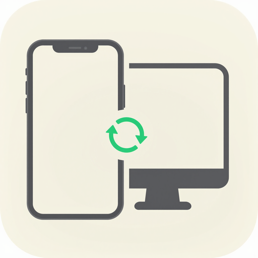

<p align="center">
  
</p>

<p align="center">
  <a href="README.md">中文</a> ·
  <a href="README.en.md">English</a> ·
  <a href="README.ja.md">日本語</a>
</p>

# ClipSync-Mac

<p align="center">
  <b>ClipSync 3端末同期システムの macOS クライアント</b><br/>
  メニューバー常駐ユーティリティ：スマホの SMS 認証コードをリアルタイムで受信し、クリップボード（テキスト/画像）を双方向同期。<br/>
  純 Swift + SwiftUI、macOS 14+、Menu Bar Extra 形式、邪魔をしない設計。
</p>

<p align="center">
  <a href="https://github.com/JH-Clipsync/ClipSync-Mac/releases">⬇️ dmg/zip をダウンロード</a> ·
  <a href="https://github.com/orgs/JH-Clipsync/packages">📦 Packages (ghcr.io)</a> ·
  <a href="https://github.com/JH-Clipsync/ClipSync-Server">🖧 サーバー</a> ·
  <a href="https://github.com/JH-Clipsync/ClipSync-Android">📱 Android 版</a>
</p>

---

## 1. できること

| 機能 | 説明 | 対応モジュール |
|---|---|---|
| **認証コード受信** | スマホの SMS 認証コードが Mac にリアルタイムでポップアップ。ワンクリックコピー/クリップボードへ自動書き込み | `WebSocketClient` + `ClipboardWriter` |
| **クリップボード双方向同期** | Mac でコピー → スマホへプッシュ；スマホでコピー → Mac のクリップボードへ書き込み | `ClipboardMonitor` / `ClipboardWriter` |
| **メニューバー常駐** | ステータスバーアイコンが接続状態（接続済み/切断/再接続中）を表示、クリックでメニューを開く | `ClipSyncApp`（MenuBarExtra） |
| **設定センター** | サーバーアドレス / Token / クリップボード自動書き込みスイッチ / クリップボード同期スイッチ | `SettingsStore` + `SettingsView` |
| **権限ガイド** | クリップボード、アクセシビリティなどの権限リクエストと状態検出 | `PermissionHelper` + `PermissionsView` |
| **トースト通知** | コンテンツ受信時にフォーカスを奪わない軽量トーストを表示 | `ToastOverlay` |
| **切断時自動再接続** | WS 切断後に指数バックオフで再接続、ステータスバーにリアルタイム反映 | `ConnectionState` |

## 2. ダウンロードとインストール

[Releases](https://github.com/JH-Clipsync/ClipSync-Mac/releases) からダウンロード：

- `ClipSync-x.y.z.dmg`：ダブルクリックで開き → 「アプリケーション」にドラッグ（推奨）
- `ClipSync-x.y.z.zip`：解凍して `.app` をそのまま使用

初回起動時に「開発元を検証できません」と表示される場合：システム設定 → プライバシーとセキュリティ → このまま開く。

起動後：
1. メニューバーに ClipSync アイコンが表示されます；
2. 設定を開き、**サーバーアドレス**（`ws://サーバーIP:8080`）と **Token**（スマホ版と一致すれば自動ペアリング）を入力；
3. 案内に従ってクリップボード権限を付与；アイコンが緑色になれば接続完了です。

## 3. メッセージプロトコル（サーバーとの取り決め）

```json
{ "type": "notify_pc", "kind": "sms_code", "text": "【某銀行】認証コード 314159" }
```

- サーバーは同じ token 配下の `role=phone` のメッセージをすべての `role=pc` にブロードキャストします。本クライアントは `role=pc` として接続します；
- 本クライアントがクリップボード内容をコピーすると `clipboard` タイプでアップロードし、スマホ版はスイッチに応じてクリップボードへ書き込むかを決定します；
- サーバーはデータを永続化せず、リアルタイムルーティングのみ行います。

## 4. ソースからのビルド

要件：macOS 14+、Xcode 16+（プロジェクト objectVersion 77）。

```bash
# コマンドラインビルド（Release、署名なし）
xcodebuild -project ClipSync.xcodeproj -scheme ClipSync \
  -configuration Release \
  -archivePath build/ClipSync.xcarchive \
  -destination 'generic/platform=macOS' \
  CODE_SIGNING_ALLOWED=NO archive

# .app を書き出し
cp -R build/ClipSync.xcarchive/Products/Applications/ClipSync.app ./

# または dmg を作成
hdiutil create -volname "ClipSync" -srcfolder ClipSync.app -ov -format UDZO ClipSync.dmg
```

または Xcode で `ClipSync.xcodeproj` を開き → ▶️ 実行。

## 5. CI 自動パッケージング

タグをプッシュすると自動的にビルドされ、Release の公開とコンテナイメージのプッシュが行われます（macos-15 ランナー、Xcode 16.4）：

```bash
git tag v1.2.0 && git push origin v1.2.0
```

成果物：`ClipSync-<バージョン>.dmg` + `ClipSync-<バージョン>.zip` が Release ページに自動的に添付されます。

## 6. プロジェクト構成

```
ClipSync/
├── ClipSyncApp.swift        # エントリー：MenuBarExtra + 設定ウィンドウ
├── ConnectionState.swift    # 接続状態マシン（切断/接続中/接続済み/再接続中）
├── WebSocketClient.swift    # WS クライアント：ハートビート、再接続、メッセージ振り分け
├── ClipboardMonitor.swift   # NSPasteboard をポーリング、変更があればアップロード
├── ClipboardWriter.swift    # 受信したコンテンツを NSPasteboard に書き込み（画像対応）
├── SettingsStore.swift      # UserDefaults 永続化設定（アドレス/Token/スイッチ）
├── Views/
│   ├── MenuBarView.swift    # メニューバーのドロップダウン内容
│   ├── SettingsView.swift   # 設定ページ
│   ├── PermissionsView.swift# 権限ガイドページ
│   └── ToastOverlay.swift   # 軽量トーストオーバーレイ
├── Helpers/
│   └── PermissionHelper.swift # 権限リクエスト/検出
├── Info.plist               # バージョン/権限宣言
└── Assets.xcassets          # アイコンリソース
```

## 7. よくある質問

| 問題 | 解決方法 |
|---|---|
| アイコンがグレーで接続できない | アドレス/Token を確認；サーバーの 8080 ポートが開放されているか確認；同じネットワークまたはパブリックアドレスを使用 |
| クリップボードが同期しない | 設定で「クリップボード同期」をオンに；システム設定でクリップボード権限を付与 |
| スマホからのプッシュを受信しない | スマホ版のサービスが起動しており、同じ Token を使用しているか確認 |
| 開けないと表示される | プライバシーとセキュリティ → このまま開く（未署名配布の通常の現象です） |
| ログイン時に自動起動したい | システム設定 → 一般 → ログイン項目 → ClipSync を追加 |

## 8. システム要件と注意事項

- 最小 macOS 14.0、Apple シリコン / Intel 両対応（CI は Apple シリコンビルドを出力；Intel はソースからビルドが必要）
- Bundle ID：`com.jiahui.ClipSyncApp`
- いかなるデータも収集しません；クリップボードの内容はお使いのデバイスとサーバー間でポイントツーポイントでのみやり取りされ、サーバーは永続化しません
